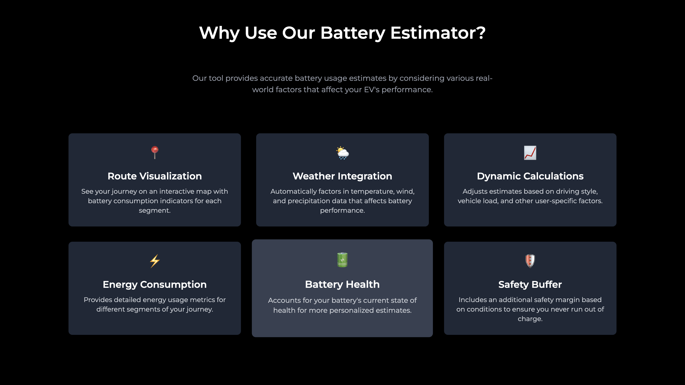
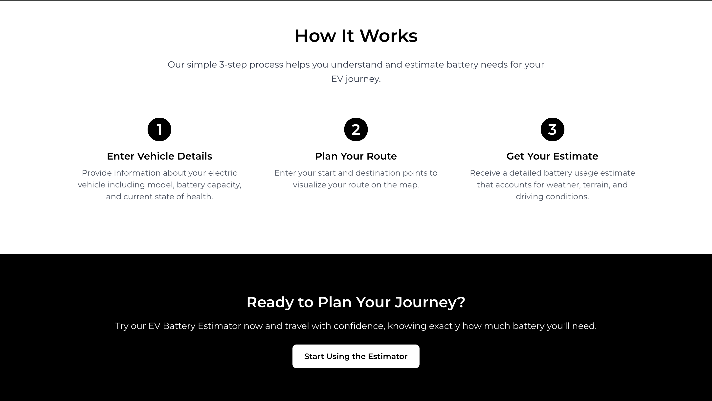
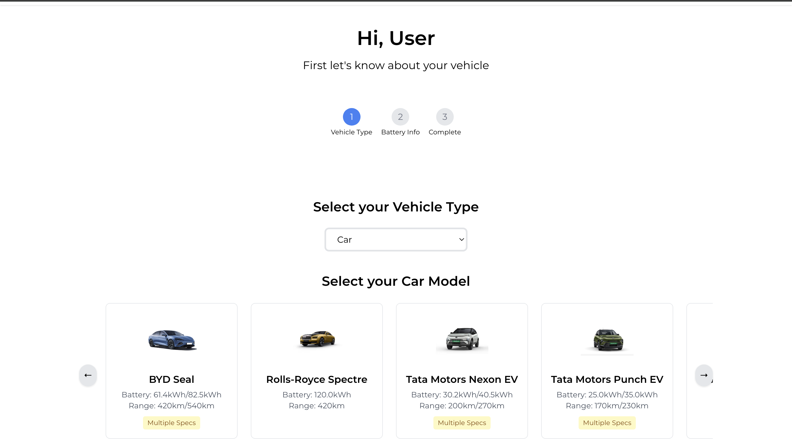
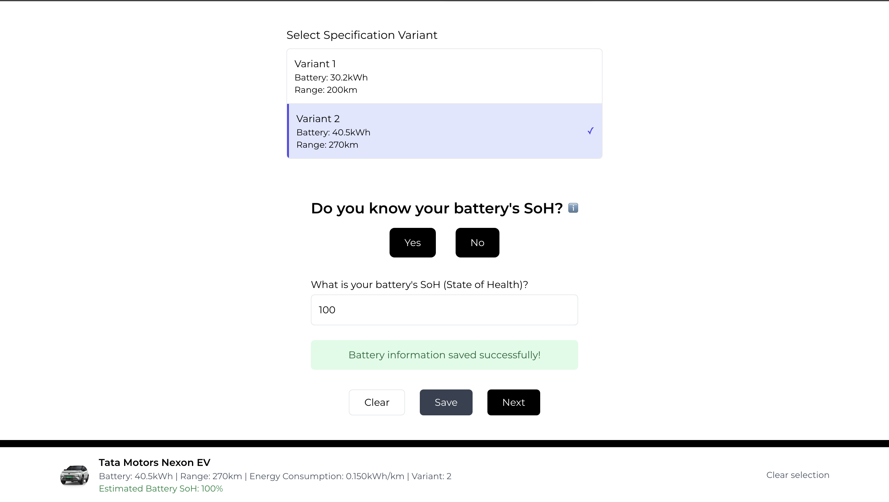
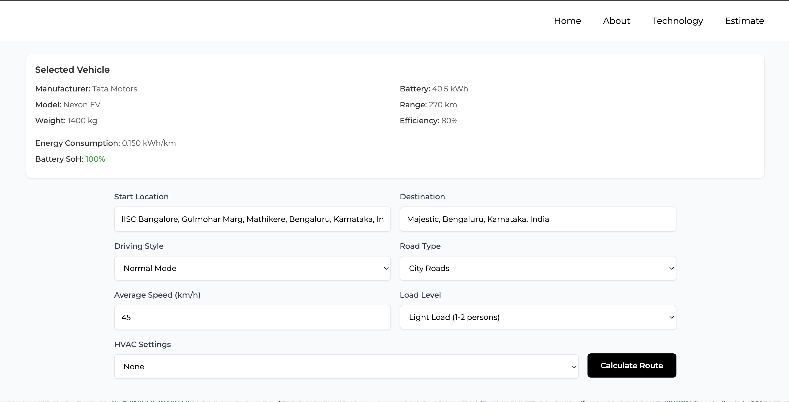

# EV Battery Estimation System (BES) 🌍

A web-based platform for Electric Vehicle (EV) owners to estimate battery usage, plan optimal routes, and discover charging stations in real time—directly from their browser. Supports both EV cars and bikes, integrating live weather, traffic, elevation, and battery health data for smarter, greener journeys.

## ✨ Features

### 🔋 Battery Estimation System (BES)
- Real-time battery percentage estimation under changing driving conditions
- Factors in State of Health (SoH), battery efficiency, HVAC load, terrain, and more
- Simulates basic EV battery control functions

### 🗺 Route Planning
- Generates optimized EV routes using Google Maps, TomTom, and live traffic/elevation/weather data
- Interactive map interface for route visualization
- Smart suggestions for charging stations along your route

### 🔌 Charging Station Discovery
- Discover nearby and en-route EV charging stations using OpenChargeMap
- Charging stations categorized as:
  - ✅ Public (Verified)
  - 🏨 Guest-only
  - 🏬 Showroom
  - ⚠️ Unverified
- **Attribution:**
  > Charging station data powered by OpenChargeMap

### 🔮 Energy & Range Estimation
- Predict energy consumption and available range for your trip
- Factors in elevation changes, HVAC usage, traffic delays, and real-time weather

### 🧩 Modular & Scalable Architecture
- Built as a modular, scalable web application
- Clean codebase with well-separated concerns for estimation, maps, and UI
- Optional Python backend for advanced analytics and heavy computation

## 📁 Project Structure

EV_BES
│
├── app.js                  # Main application logic
├── config.js               # Configuration file
├── index.html              # Main entry point for the site
├── styles.css              # Global styles
├── package.json            # Project metadata and dependencies
├── README.md               # Documentation
├── ev-car-clean-bg.png     # Background image
│
├── about/                  # About section details
│   ├── about.html
│   └── styles.css
│
├── api/                    # API configuration
│   └── map-config.json
│
├── estimate/               # Battery and energy estimation logic
│   ├── estimate.html
│   ├── script.js
│   ├── styles.css
│   └── images/
│       ├── bikes/
│       └── cars/
│
├── map/                    # Route planning & map logic
│   ├── map.html
│   ├── script.js
│   ├── styles.css
│   ├── README.md
│   └── icons/
│       ├── icons8-map-pin-16.png
│       └── icons8-map-pin-30.png
│
├── middleware/             # Security and middleware logic
│   └── security.js
│
├── technology/             # Technology page details
    ├── technology.html
    ├── styles.css
    ├── car-tech.png
    └── technology.png

## 🚀 Getting Started

1️⃣ **Clone the Repository**
```bash
git clone https://github.com/Syvoltorg/EV-Battery-Estimation-System-Website.git
cd EV-Battery-Estimation-System-Website
```

2️⃣ **Install Dependencies**
```bash
npm install
```

3️⃣ **Start Development Server**
```bash
npm start
```

4️⃣ **Build the Website**
```bash
npm run build
```
This prepares a production-ready version in the dist/ folder.

5️⃣ **Deploy**
Upload the contents of dist/ to your preferred web host (e.g., GitHub Pages, Vercel, Netlify, etc.)

## 🔐 API Keys

Some features require external APIs (maps, traffic, weather, and charging stations).

- **Local Storage:** Keys are stored in `api/map-config.json`
- **Security Tips:**
  - Do not commit keys to public repositories
  - Add `api/map-config.json` to `.gitignore`
  - For better security, migrate key usage to the backend

### API Key Details & Limits
| API Service        | Purpose                  | Free Limit                        |
|--------------------|--------------------------|-----------------------------------|
| Google Maps API    | Maps, routing, traffic   | $200 free/month (billing required)|
| WeatherStack API   | Weather data             | 250 requests/month                |
| TomTom API         | Traffic & routing        | 2,500 requests/day                |
| Open Charge Map    | EV charging stations     | Free for open-source use          |

## 🖼️ Screenshots
<p align="center">
  <table>
    <tr>
      <td></td>
      <td></td>
    </tr>
    <tr>
      <td></td>
      <td></td>
    </tr>
    <tr>
      <td></td>
      <td></td>
    </tr>
    <tr>
      <td></td>
      <td></td>
    </tr>
  </table>
</p>

**Screenshot Flow**
- Intro – Minimal homepage UI
- About section
- Technology info
- Vehicle selection
- Range estimation
- Location input
- Map with route and stations
- Charging station details

## 🙌 Contributing

Feel free to submit pull requests or open issues for any bugs or feature requests. If you add new APIs or update architecture, make sure to update the documentation too.

## 📜 License

Licensed under the GNU GPL v3 License.
See the [LICENSE](LICENSE) file for full terms.
